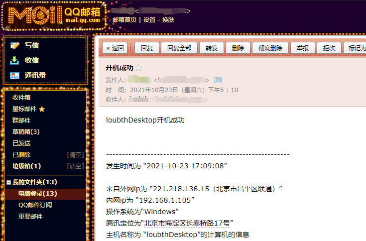

# 开机成功后发邮件提醒

## 作用

在电脑开机时向邮箱发送邮件提醒

## 运行环境

由于程序是java程序，因此使用前请安装java环境

## 使用步骤

### 开启邮箱的允许第三方程序代替邮箱收发邮件的服务

因为不可能别人随便写个程序就能通过你的邮箱发送收取邮件，所以必须打开邮箱允许第三方程序收发邮件的服务（SMTP、POP、IMAP等），同时还要配置授权码（类似登录密码）

以qq邮箱为例，开启相关服务的方式如下（开启服务会让你填授权码，这个授权码需要保存）

### 配置任务计划

#### 打开任务计划程序选择创建任务

#### 按如下操作配置任务计划

常规

触发器要添加两种，一种是休眠唤醒的，一种是重启的

休眠唤醒需要的触发器

重启需要的触发器

接下来设置事件发生时的操作

条件

设置

### 填写程序配置项

#### 在“启动.vbs”文件中配置程序路径

用记事本打开文件“启动.vbs”，配置一下jar包（emailPrompt.jar）位置。记得要把jar包路径写全，因为任务计划程序有时候找不到起始位置

#### 在“config.properties”文件中配置发送内容及所需信息

注意点：邮箱服务器填你用的邮箱的服务器地址，如果是qq邮箱就不用改，不是的话百度一下你邮箱的邮箱服务器地址

到此程序就配置完成，你重启电脑的时候就会收到你的邮件了